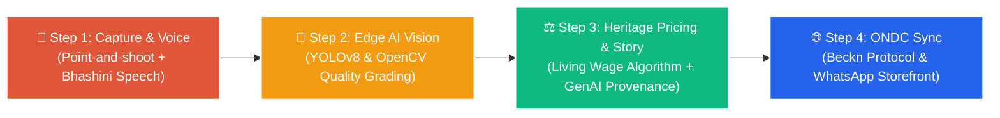

# 🪔 Smart Artisan Companion (स्मार्ट कारीगर साथी)
### AI-Driven Market Linkage & Smart Cataloguing Mobile Application for Marginalized Artisans

[](https://sih.gov.in/)
[](https://sih.gov.in/)
[]()
[]()
[](https://fastapi.tiangolo.com)
[](https://react.dev)
[](https://ondc.org)
[](https://tensorflow.org)

---

## 📌 1. Project Overview

Developed by **Team Bro Code** for **Smart India Hackathon 2026**, **Smart Artisan Companion** is an AI-powered, offline-first mobile application designed to bridge the digital and economic divide for millions of marginalized Indian artisans. 

By replacing predatory middleman trader cartels with automated on-device computer vision cataloguing, multilingual voice-to-text input, fair-wage heritage pricing, and direct publishing to India's **Open Network for Digital Commerce (ONDC)**, the platform empowers non-literate rural craftspeople to capture true global market value.

---

## 🏛️ 2. Core Pillars & Innovation



### 1. Zero Literacy Barrier: Multilingual Voice-to-Text (BHASHINI / Whisper AI)
- Non-literate rural craftspeople describe their product in their native mother tongue (Hindi, Bengali, Tamil, Telugu, Marathi, etc.).
- Natural Language Entity Extraction parses dimensions, labor hours, and raw material costs into structured commerce attributes in seconds.

### 2. Edge AI Vision Cataloguing (TensorFlow Lite & YOLOv8)
- On-device inference eliminates the need for stable 4G/5G cellular coverage in remote craft clusters.
- Automatically crops objects, extracts dimensions, detects craft materials, and computes bilateral symmetry.

### 3. Automated Visual Quality Rating
- OpenCV-powered structural analysis scores rotational symmetry and weave/surface density.
- Awards verifiable trust badges (*Masterpiece Grade A+ GI Certified*, *Heritage Grade A*), building urban buyer confidence.

### 4. Heritage Pricing Engine (Living Wage Model)
- Replaces exploitative trader margins with transparent cost formulas based on raw material expenses, artisan skill tiers (Apprentice, Skilled, Master Artisan), and craft complexity.
- Delivers an average **+200% to +300% income increase** directly into the artisan's bank account.

### 5. Generative Craft Storytelling & Verifiable Provenance
- Generates culturally rich origin stories highlighting geographic lineage and sustainable production.
- Mints cryptographic SHA-256 Authenticity Certificates with QR verification links.

### 6. Direct Market Distribution (ONDC & WhatsApp Business)
- 1-click catalog sync adhering to the Beckn Protocol specification (`/search`, `/on_search`, `/select`).
- Direct-to-Consumer buyer discovery via Paytm, Pincode, Mystore, and conversational WhatsApp storefronts.

### 7. Resilient Offline-First Architecture
- Full offline execution with local SQLite storage; automatically queues transactions and synchronizes seamlessly when cellular connectivity returns.

---

## 🏗️ 3. System Architecture & Tech Stack

```
SIH_8-9-26/
├── backend/                  # FastAPI (Python 3.11+) Ecosystem
│   ├── app/
│   │   ├── main.py           # Application entrypoint & CORS
│   │   ├── core/config.py    # Environment settings & config
│   │   ├── core/database.py  # SQLAlchemy database session
│   │   ├── models/artisan.py # ORM models (Artisans, Products, Certificates, Sync)
│   │   ├── schemas/artisan.py# Pydantic request/response schemas
│   │   ├── services/
│   │   │   ├── pricing_engine.py      # Heritage fair-wage pricing algorithm
│   │   │   ├── story_engine.py        # GenAI storytelling & provenance hash
│   │   │   ├── quality_evaluator.py   # OpenCV symmetry & weave density
│   │   │   ├── voice_bhashini.py      # Vernacular voice transcription pipeline
│   │   │   └── ondc_beckn.py          # ONDC Beckn protocol handlers
│   │   └── api/routes.py              # REST API endpoints
│   ├── requirements.txt      # Python dependencies
│   └── Dockerfile            # Container deployment definition
│
├── frontend/                 # Mobile-First Progressive Web App (React + Vite)
│   ├── src/
│   │   ├── components/
│   │   │   ├── Navbar.jsx             # Vernacular language selector & connection badge
│   │   │   ├── VoicePromptCapture.jsx # Speech input with live audio wave animation
│   │   │   ├── VisionScanner.jsx      # Point-and-shoot camera with laser sweep
│   │   │   ├── PricingCalculator.jsx  # Heritage pricing breakdown sliders
│   │   │   ├── StoryCertificate.jsx   # Generative story & authenticity badge
│   │   │   ├── ONDCPublishModal.jsx   # 1-click ONDC & WhatsApp publisher
│   │   │   ├── OfflineSyncQueue.jsx   # Edge SQLite offline sync queue
│   │   │   └── NationalImpactMetrics.jsx # Official MSME & Vishwakarma statistics
│   │   ├── App.jsx           # Master workflow controller & device simulation
│   │   └── index.css         # Glassmorphic Indian artisan aesthetic
│   └── package.json
│
├── ai_engine/                # On-Device Edge Models & Specifications
│   ├── cv_analyzer.py        # Symmetry & texture density algorithms
│   ├── edge_tflite_specs.md  # Low-resource INT8 model quantization guide
│   └── sample_catalog_data.json # Authentic Indian handicraft dataset
│
├── docker-compose.yml        # Multi-container orchestration
├── .env.example              # Environment variables template
└── .gitignore                # Git ignore configuration
```

| Layer | Technologies Used |
| :--- | :--- |
| **Mobile & Frontend** | React 18, Vite 6, Tailwind/Vanilla CSS (Glassmorphism), Lucide Icons, SQLite/IndexedDB PWA |
| **Backend & API** | FastAPI (Python 3.11+), Pydantic v2, SQLAlchemy, Uvicorn |
| **Edge AI & Computer Vision** | OpenCV, NumPy, TensorFlow Lite (INT8 PTQ), YOLOv8-Nano |
| **Voice & Vernacular** | Digital India BHASHINI API, OpenAI Whisper-Tiny, Regional ASR |
| **E-Commerce Protocol** | ONDC (Open Network for Digital Commerce) Beckn Protocol v1.2.0 |
| **DevOps & Infrastructure** | Docker, Docker Compose, AWS Cloud ready |

---

## 📊 4. National Scale & Government Alignment

Aligned with key Government of India initiatives:
- **PM Vishwakarma Scheme**: Empowering 18 traditional artisan trades with fair credit, skill certification, and direct market linkage.
- **Pahchan Initiative (Ministry of Textiles)**: Direct digital inclusion for verified artisan cardholders.
- **Digital India & BHASHINI**: Language computing eliminating tech barriers.
- **UN Sustainable Development Goal 8**: Decent Work and Sustainable Economic Growth.

### Key Impact Metrics (MSME & PIB Data)
* **30 Lakh+** PM Vishwakarma registrations in the national pipeline.
* **24.29 Lakh** beneficiaries trained and certified in traditional craft trades.
* **₹5,235.8 Crore** in subsidized institutional loans approved.
* **32.90 Lakh** artisans mobilized under Ministry of Textiles Pahchan.

---

## 🚀 5. Quickstart & Local Setup

### Prerequisites
- Python 3.10+
- Node.js v18+ (Node 20+ recommended)
- Git

### Option A: Running with Docker Compose (Recommended)
```bash
# Clone the repository
git clone https://github.com/joshigaurav542-design/SIH_8-9-26.git
cd SIH_8-9-26

# Launch backend and frontend containers
docker compose up --build
```
- Frontend application: `http://localhost:5173`
- Backend API & Interactive Swagger Docs: `http://localhost:8000/docs`

---

### Option B: Running Bare Metal (Manual Setup)

#### 1. Backend Setup
```bash
# Navigate to backend directory
cd backend

# Create and activate virtual environment
python -m venv venv
# On Windows:
.\venv\Scripts\activate
# On Linux/macOS:
source venv/bin/activate

# Install dependencies
pip install -r requirements.txt

# Run FastAPI development server
uvicorn app.main:app --reload --host 0.0.0.0 --port 8000
```
Swagger UI will be available at: `http://localhost:8000/docs`

#### 2. Frontend Setup
```bash
# In a separate terminal, navigate to frontend directory
cd frontend

# Install Node dependencies
npm install

# Start Vite dev server
npm run dev
```
Client will be accessible at: `http://localhost:5173`

---

## 🧪 6. Automated Testing

To run the backend test suite verifying the Heritage Pricing Engine, Generative Storyteller, Voice parser, and ONDC endpoints:

```bash
cd backend
pytest tests/
```

---

## 👥 7. Team & Attribution

- **Hackathon**: Smart India Hackathon (SIH) 2026
- **Problem Statement ID**: SIH26090
- **Team Name**: **Bro Code**
- **Repository**: [joshigaurav542-design/SIH_8-9-26](https://github.com/joshigaurav542-design/SIH_8-9-26)
- **License**: MIT
